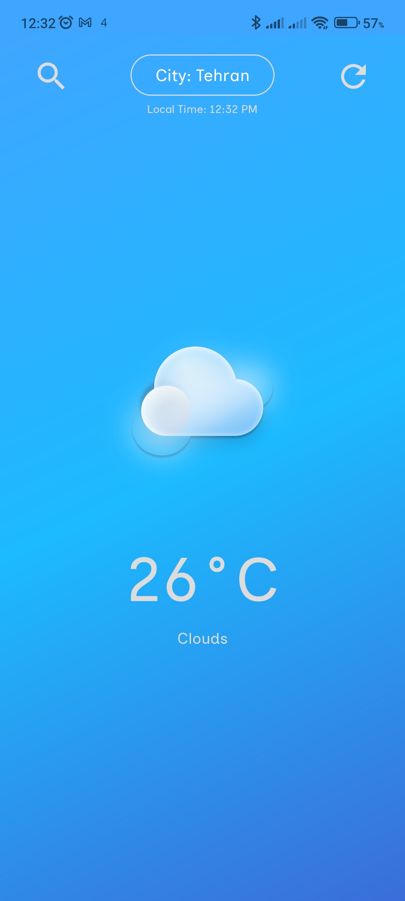

# 🌤️ WeatherApp

A modern, feature-rich Android weather application built with Kotlin that provides real-time weather information for cities worldwide using OpenWeatherMap API.

[](https://kotlinlang.org/)
[](https://developer.android.com/)
[](LICENSE)

## 📱 Screenshots

<div align="center">
  
  
  
</div>

## ✨ Features

- **🌍 Global City Search**: Search and find weather information for any city worldwide
- **🌡️ Real-time Weather Data**: Get current temperature, weather conditions, and atmospheric details
- **🌅 Dynamic Day/Night Themes**: Automatic background switching based on local time
- **📱 Modern UI/UX**: Clean, intuitive interface with Material Design principles
- **🔍 Smart Search**: Intelligent city search with autocomplete suggestions
- **📊 Detailed Weather Info**: Comprehensive weather data including temperature, conditions, and more
- **🎨 Responsive Design**: Optimized for various screen sizes and orientations

## 🛠️ Tech Stack

- **Language**: Kotlin
- **Architecture**: MVVM (Model-View-ViewModel)
- **UI Framework**: Android XML Layouts with Data Binding
- **Networking**: Retrofit2 + GSON
- **API**: OpenWeatherMap Weather & Geocoding APIs
- **Navigation**: Android Navigation Component
- **Lifecycle**: Android Architecture Components
- **Build System**: Gradle with Kotlin DSL

## 📋 Prerequisites

- Android Studio Arctic Fox or later
- Android SDK API 26+ (Android 8.0+)
- Kotlin 1.8.0+
- Internet connection for API calls

## 🚀 Installation

1. **Clone the repository**
   ```bash
   git clone https://github.com/yourusername/WeatherApp.git
   cd WeatherApp
   ```

2. **Open in Android Studio**

3. **Configure API Key**
   - Sign up for a free API key at [OpenWeatherMap](https://openweathermap.org/api)
   - Replace the API key in `WeatherViewModel.kt`:
     ```kotlin
     private const val API_KEY: String = "YOUR_API_KEY_HERE"
     ```

4. **Build and Run**

## 🏗️ Project Structure

```
WeatherApp/
├── app/
│   ├── src/main/
│   │   ├── java/lol/kiyarash/weatherapp/
│   │   │   ├── data/           # Data models and binding adapters
│   │   │   ├── network/        # API services and network layer
│   │   │   ├── view/           # Activities, fragments, and adapters
│   │   │   └── viewModel/      # ViewModels and business logic
│   │   ├── res/                # Resources (layouts, drawables, values)
│   │   └── AndroidManifest.xml
│   └── build.gradle.kts        # App-level build configuration
├── build.gradle.kts            # Project-level build configuration
└── README.md
```

## 🔧 Configuration

### API Configuration
The app uses two main APIs:
- **Weather API**: Fetches current weather data
- **Geocoding API**: Converts city names to coordinates

### Units
Weather data is displayed in metric units (Celsius) by default. You can modify this in `WeatherViewModel.kt`:
```kotlin
private const val UNITS: String = "metric" // or "imperial" for Fahrenheit
```

## 🔒 Permissions

The app requires the following permissions:
- `INTERNET`: For API calls to OpenWeatherMap
- `ACCESS_NETWORK_STATE`: For network connectivity checks

## 📦 Dependencies

Key dependencies include:
- **Retrofit2**: HTTP client for API calls
- **GSON**: JSON parsing
- **Lifecycle Components**: ViewModel and LiveData
- **Navigation Component**: Fragment navigation
- **Data Binding**: View binding and data binding

**Made with ❤️ using Kotlin**
